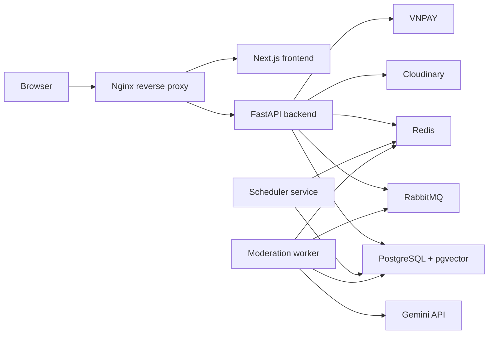

# YAG - Writing Novels Web

[](https://github.com/zeus058/SE_Writing_Web/actions/workflows/ci.yml)
[](https://nextjs.org)
[](https://react.dev)
[](https://fastapi.tiangolo.com)
[](https://www.postgresql.org)
[](https://www.docker.com)

YAG is a full-stack web application for reading and writing online novels with AI-assisted authoring, semantic story search, asynchronous AI moderation, real-time notifications, and premium membership payments.

This repository is built for the HCMUS 2025-2026 Introduction to Software Engineering project.

## Contents

- [Features](#features)
- [Tech Stack](#tech-stack)
- [Architecture](#architecture)
- [Repository Structure](#repository-structure)
- [Local Development](#local-development)
- [Environment Variables](#environment-variables)
- [Database Migrations](#database-migrations)
- [Testing](#testing)
- [Docker Compose](#docker-compose)
- [Production Deployment](#production-deployment)
- [CI/CD](#cicd)
- [API Map](#api-map)
- [Project Hygiene](#project-hygiene)
- [Team](#team)

## Features

| Area | Capability |
|---|---|
| Authentication | Register, login, JWT auth, reset password, change password, role-based access |
| Reader | Home feed, story discovery, story detail, reader mode, comments, reviews, library, reading history |
| Author | Story management, chapter drafting, autosave WebSocket, AI writing suggestions, scheduled publishing |
| AI | Gemini plot suggestions, story embeddings, semantic search, recommendations, moderation assistance |
| Moderation | RabbitMQ background worker, AI moderation logs, admin review queue, alerts, notifications |
| Membership | Membership plan catalog, premium chapter access, VNPAY checkout, VNPAY IPN verification |
| Admin | Dashboard metrics, moderation queue, user/story controls, audit logs |
| Realtime | Native WebSocket routes for notifications and chapter draft autosave |

## Tech Stack

| Layer | Technology |
|---|---|
| Frontend | Next.js 16, React 19, TypeScript, TailwindCSS v4 |
| Backend | FastAPI, Gunicorn, Uvicorn, Pydantic, SQLAlchemy 2 |
| Database | PostgreSQL 16 with pgvector |
| Cache | Redis 7 |
| Queue | RabbitMQ 3.13 |
| AI | Google Gemini API, `gemini-1.5-flash`, `text-embedding-004` |
| Media | Cloudinary |
| Payment | VNPAY primary; PayOS service support exists behind configuration |
| Scheduler | APScheduler |
| Deployment | Docker Compose, Nginx, optional Google Cloud Run backend deployment |
| CI | GitHub Actions, pytest, ESLint, Docker build validation, Bandit, optional SonarQube |

## Architecture



### Runtime services

| Service | Role |
|---|---|
| `postgres` | Main relational database and pgvector storage |
| `redis` | Session/cache/view count/pub-sub support |
| `rabbitmq` | Async moderation queue |
| `migrate` | One-shot migration runner |
| `backend` | FastAPI API server |
| `scheduler` | Dedicated scheduled jobs service |
| `moderation-worker` | RabbitMQ consumer for AI moderation |
| `frontend` | Next.js standalone frontend |
| `nginx` | HTTP/HTTPS reverse proxy and WebSocket routing |

## Repository Structure

```text
SE_Writing_Web/
├── .github/
│   └── workflows/
│       └── ci.yml
├── docs/
│   └── task/
├── nginx/
│   ├── certs/
│   │   └── .gitignore
│   └── nginx.conf
├── src/
│   ├── backend/
│   │   ├── app/
│   │   │   ├── api/
│   │   │   ├── core/
│   │   │   ├── models/
│   │   │   ├── schemas/
│   │   │   ├── services/
│   │   │   ├── worker/
│   │   │   ├── main.py
│   │   │   ├── manage_migrations.py
│   │   │   ├── reset_dev_db.py
│   │   │   └── seed.py
│   │   ├── migrations/
│   │   ├── tests/
│   │   ├── Dockerfile
│   │   ├── requirements.txt
│   │   └── worker.py
│   └── frontend/
│       ├── src/
│       │   ├── app/
│       │   ├── components/
│       │   ├── data/
│       │   └── lib/
│       ├── Dockerfile
│       ├── package.json
│       └── package-lock.json
├── .env.example
├── AGENTS.md
├── docker-compose.yml
├── README.md
└── sonar-project.properties
```

## Local Development

### Prerequisites

- Git
- Docker Desktop or Docker Engine with Compose v2
- Python 3.11+
- Node.js 20+

### 1. Clone the repository

```bash
git clone https://github.com/zeus058/SE_Writing_Web.git
cd SE_Writing_Web
```

### 2. Start infrastructure

The default Compose profile starts only PostgreSQL, Redis, and RabbitMQ.

```bash
docker compose up -d
```

Local infrastructure defaults:

| Service | URL/Port | Credentials |
|---|---|---|
| PostgreSQL | `localhost:5432` | `yag_user / yag_secret`, database `yag_db` |
| Redis | `localhost:6379` | no password by default |
| RabbitMQ | `localhost:5672` | `yag_mq / yag_mq_secret` |
| RabbitMQ UI | `http://localhost:15672` | `yag_mq / yag_mq_secret` |

### 3. Configure backend

```bash
cd src/backend
cp .env.example .env
```

For local Docker infrastructure, keep:

```env
POSTGRES_SERVER=localhost
POSTGRES_USER=yag_user
POSTGRES_PASSWORD=yag_secret
POSTGRES_DB=yag_db
REDIS_HOST=localhost
RABBITMQ_HOST=localhost
RABBITMQ_USER=yag_mq
RABBITMQ_PASSWORD=yag_mq_secret
```

Set real values for AI/media/payment features when needed:

```env
GEMINI_API_KEY=...
CLOUDINARY_CLOUD_NAME=...
CLOUDINARY_API_KEY=...
CLOUDINARY_API_SECRET=...
VNP_TMN_CODE=...
VNP_HASH_SECRET=...
```

Install dependencies and run migrations:

```bash
python -m venv .venv
.venv\Scripts\activate
pip install -r requirements.txt
python -m app.manage_migrations
```

Optional development seed:

```bash
python -m app.seed
```

Start the API:

```bash
uvicorn app.main:app --reload --port 8000
```

Start the moderation worker in a separate terminal:

```bash
cd src/backend
.venv\Scripts\activate
python worker.py
```

### 4. Configure frontend

```bash
cd src/frontend
cp .env.example .env
npm install
npm run dev
```

Open:

| App | URL |
|---|---|
| Frontend | `http://localhost:3000` |
| Backend docs | `http://localhost:8000/docs` |
| Backend readiness | `http://localhost:8000/health/ready` |

## Environment Variables

### Backend essentials

| Variable | Purpose |
|---|---|
| `ENVIRONMENT` | `development`, `staging`, or `production` |
| `SERVICE_ROLE` | `api`, `worker`, `migrate`, or `scheduler` |
| `SECRET_KEY` | JWT signing key |
| `CORS_ORIGINS` | Comma-separated frontend origins |
| `DATABASE_URL` | Optional full PostgreSQL URL; overrides component DB vars |
| `POSTGRES_*` | PostgreSQL component config |
| `REDIS_URL` | Optional full Redis URL |
| `REDIS_HOST`, `REDIS_PORT`, `REDIS_PASSWORD` | Redis component config |
| `RABBITMQ_URL` | Optional full RabbitMQ URL |
| `RABBITMQ_*` | RabbitMQ component config |
| `GEMINI_API_KEY` | Gemini AI features |
| `CLOUDINARY_*` | Avatar and cover uploads |
| `VNP_*` | VNPAY checkout and IPN verification |
| `ALLOW_WEBSOCKET_QUERY_TOKEN` | Must be `false` in production |

### Frontend essentials

| Variable | Purpose |
|---|---|
| `NEXT_PUBLIC_APP_URL` | Public frontend origin |
| `NEXT_PUBLIC_API_BASE_URL` | API origin, without `/api/v1` |
| `NEXT_PUBLIC_WS_BASE_URL` | WebSocket origin/path |
| `NEXT_PUBLIC_DEPLOY_ENV` | `development`, `staging`, or `production` |
| `NEXT_PUBLIC_USE_MOCKS` | UI mock mode; must be `false` outside demos |
| `NEXT_PUBLIC_API_TIMEOUT_MS` | API request timeout |

## Database Migrations

The backend uses a custom versioned SQL migration runner instead of Alembic.

```bash
cd src/backend
python -m app.manage_migrations
python -m app.manage_migrations --check
```

Rules:

- Do not edit already-applied migration files.
- Add new schema changes as `src/backend/migrations/V{N}__description.sql`.
- The `schema_migrations` table stores filename, version, checksum, and apply time.
- Membership plans are initialized by `V4__init_membership_plans.sql`.
- `app.seed` is for development data only and must not be used for production initialization.

## Testing

### Backend

```bash
cd src/backend
python -m pytest -q
python -m pytest --cov=app --cov-report=term-missing --cov-report=xml:coverage.xml
python -m flake8 app tests --count --select=E9,F63,F7,F82 --show-source --statistics
```

### Frontend

```bash
cd src/frontend
npm run lint
npm run build
```

### Docker config validation

```bash
docker compose config
docker compose --profile prod config
```

## Docker Compose

### Profiles

| Command | Services | Use |
|---|---|---|
| `docker compose up -d` | `postgres`, `redis`, `rabbitmq` | Local infrastructure |
| `docker compose --profile app up -d --build` | Full stack | Local full-stack container test |
| `docker compose --profile prod up -d --build` | Full stack | VM/VPS production deployment |

For the `app` profile, create a root `.env` from `.env.example` and keep `ENVIRONMENT=development`.

For the `prod` profile:

- Set `ENVIRONMENT=production`.
- Use strong non-default secrets.
- Set HTTPS `CORS_ORIGINS`, `FRONTEND_PUBLIC_URL`, `API_PUBLIC_URL`, and `WS_PUBLIC_URL`.
- Place TLS files at:
  - `nginx/certs/fullchain.pem`
  - `nginx/certs/privkey.pem`

## Production Deployment

### Self-hosted Docker Compose

1. Prepare a server with Docker and Docker Compose.
2. Clone the repository.
3. Copy `.env.example` to `.env` at the repository root.
4. Fill all production variables.
5. Add TLS certificates under `nginx/certs/`.
6. Start the production profile:

```bash
docker compose --profile prod up -d --build
docker compose ps
docker compose logs -f backend moderation-worker nginx
curl -fsS https://your-domain.com/health/ready
```

### Required production values

Production startup validation rejects unsafe configuration. At minimum:

```env
ENVIRONMENT=production
SECRET_KEY=<strong random value>
ALLOW_WEBSOCKET_QUERY_TOKEN=false
CORS_ORIGINS=https://your-domain.com
FRONTEND_PUBLIC_URL=https://your-domain.com
API_PUBLIC_URL=https://your-domain.com
WS_PUBLIC_URL=wss://your-domain.com/ws
REDIS_PASSWORD=<strong password or use REDIS_URL>
RABBITMQ_USER=<non-default user or use RABBITMQ_URL>
RABBITMQ_PASSWORD=<strong password or use RABBITMQ_URL>
GEMINI_API_KEY=<production key>
CLOUDINARY_CLOUD_NAME=<production value>
CLOUDINARY_API_KEY=<production value>
CLOUDINARY_API_SECRET=<production value>
VNP_TMN_CODE=<production merchant code>
VNP_HASH_SECRET=<production hash secret>
VNP_URL=<production VNPAY payment URL>
VNP_RETURN_URL=https://your-domain.com/payment/result
VNP_API_URL=<production VNPAY API URL>
```

Important: `API_PUBLIC_URL` is the origin only, for example `https://your-domain.com`, because the frontend client appends `/api/v1`.

## CI/CD

GitHub Actions runs on pushes and pull requests to `dev` and `main`.

### Validation jobs

- Backend: install Python dependencies, flake8 critical lint, migrations, pytest with coverage.
- Frontend: install Node dependencies, ESLint, Next.js build.
- Security: `pip-audit`, `npm audit`, Bandit.
- Docker: backend/frontend Docker build check on pull requests.
- SonarQube: optional when `SONAR_TOKEN` and `SONAR_HOST_URL` are configured.

### Deployment jobs

Production deployment jobs run only on `push` to `main`.

Current automated deployment path:

- Apply production migrations when `DATABASE_URL` GitHub secret exists.
- Build and deploy the backend image to Google Cloud Run when GCP Workload Identity Federation secrets exist.
- Frontend production deploy is expected to be handled by the hosting provider integration, such as Vercel connected to `main`.

Required GitHub secrets for Cloud Run backend deploy:

```text
GCP_WORKLOAD_IDENTITY_PROVIDER
GCP_SERVICE_ACCOUNT
GCP_PROJECT_ID
DATABASE_URL
```

Optional GitHub secrets:

```text
GCP_REGION
GCP_GAR_REPO
SONAR_TOKEN
SONAR_HOST_URL
```

Cloud Run deployment expects these Google Secret Manager secrets:

```text
yag-database-url
yag-secret-key
yag-cors-origins
yag-redis-url
yag-rabbitmq-url
yag-gemini-key
yag-cloudinary-name
yag-cloudinary-key
yag-cloudinary-secret
yag-vnp-tmn-code
yag-vnp-hash-secret
yag-vnp-url
yag-vnp-return-url
yag-vnp-api-url
```

If those secrets are not configured, CI validation still runs and deployment jobs are skipped or fail clearly at the deployment boundary.

## API Map

All API routes are mounted under `/api/v1`.

| Prefix | Module |
|---|---|
| `/auth` | Authentication, profile auth helpers, password flows |
| `/stories` | Story CRUD, story detail, reviews, library/history helpers |
| `/chapters` | Chapter CRUD, comments, reading, view count |
| `/author/chapters` | Author autosave and draft editing helpers |
| `/publish` | Publish and moderation submission flows |
| `/payment` | VNPAY and payment history |
| `/payments` | Frontend-compatible payment alias |
| `/membership` | Membership plans and checkout alias |
| `/ai` | AI suggestions and semantic search helpers |
| `/recommendations` | Recommendation endpoints |
| `/admin` | Admin dashboard, moderation, audit, alerts |
| `/notifications` | Notification listing and read state |

WebSocket routes:

| Route | Purpose |
|---|---|
| `/ws/notifications/{user_id}` | User notification stream |
| `/api/v1/ws/notifications/{user_id}` | Versioned notification stream alias |
| `/ws/stories/{story_id}/chapters/{chapter_id}` | Author chapter draft autosave |

Health routes:

| Route | Purpose |
|---|---|
| `/health` | Basic health |
| `/health/live` | Liveness |
| `/health/ready` | DB, Redis, RabbitMQ readiness |

## Project Hygiene

- Do not commit `.env`, `.venv`, `node_modules`, `.next`, generated coverage, cache files, uploads, or TLS private keys.
- Keep production certificates outside Git; only `nginx/certs/.gitignore` is tracked.
- Keep root README as the canonical public documentation.
- Use `AGENTS.md` as the detailed internal engineering map for AI agents and project maintainers.
- Add new database changes through new migration files only.

## Troubleshooting

| Symptom | Check |
|---|---|
| Backend cannot start in production | Read the production validation error from `app/core/config.py` |
| Migration checksum mismatch | A migration already applied to DB was edited; create a new migration instead |
| AI moderation stays pending | Check `moderation-worker` logs and RabbitMQ queues |
| Semantic search returns weak results | Check `story_embeddings` data and Gemini embedding calls |
| VNPAY result fails | Check `VNP_HASH_SECRET`, secure hash, transaction amount, and response/status codes |
| WebSocket fails in production | Check Nginx `/ws/` routing, cookies, and `ALLOW_WEBSOCKET_QUERY_TOKEN=false` |
| Frontend API URL is wrong | `NEXT_PUBLIC_API_BASE_URL` must be the origin only, without `/api/v1` |

## Team

| Member | Main module | API prefix |
|---|---|---|
| Tran Gia Hien | F1 - Authentication | `/api/v1/auth` |
| Nguyen Duy Truong | F2 - VNPAY Payment and Membership | `/api/v1/payment`, `/api/v1/membership` |
| Pham Huong Tra | F3 - AI Engine | `/api/v1/ai`, `/api/v1/recommendations` |
| Huynh Yen Nhi | F4 - Stories, Chapters, Editor | `/api/v1/stories`, `/api/v1/chapters` |
| Nguyen Phu Tho | F5 - Admin, Moderation | `/api/v1/admin` |

## License

No license file is currently included. Add a `LICENSE` file before distributing the project publicly under a specific open-source license.
