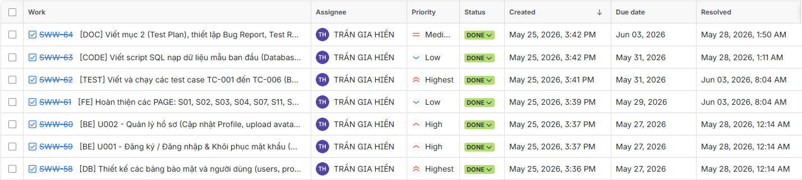
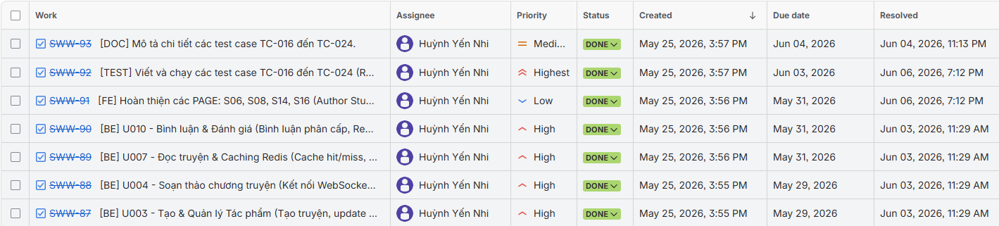
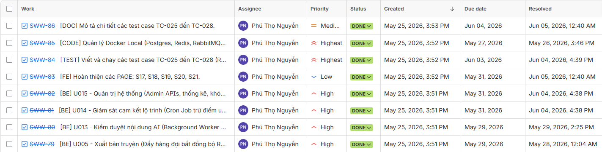
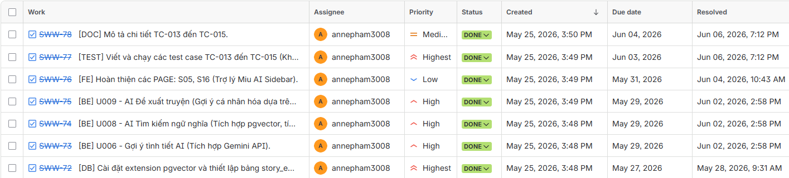
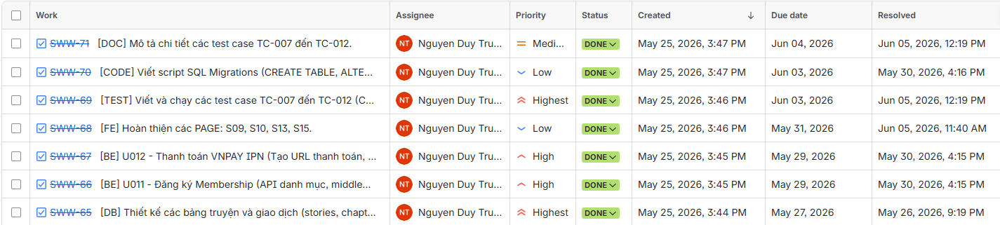

### Intro2SE - Testing - Group 1

# YAG - WRITING NOVELS WEB

*Đồ án môn học Nhập môn Công nghệ phần mềm - HCMUS - Chính quy/2025-2026.*

**Mục lục**`
- [1. Member Contribution Assessment](#member-contribution-assessment)
- [2. Test plan](#test-plan)
- [3. Test cases](#test-cases)
  - [3.1. List of test cases](#list-of-test-cases)
  - [3.2. Test case specifications](#test-case-specifications)
- [4. AI Usage Declaration](#ai-usage-declaration)
- [5. Presentation](#presentation)
- [6. Reflective Report](#reflective-report)

## 1. Member Contribution Assessment

### 23120123 - Trần Gia Hiển (25%)

| Nhiệm vụ | Mô tả chi tiết |
| :--- | :--- |
| ***TC-001 Bcrypt hash password*** | Viết và chạy unit test hàm băm mật khẩu |
| ***TC-002 Register -> JWT*** | Viết integration test luồng đăng ký -> JWT -> gọi API |
| ***TC-003 Login Rate Limit*** | Viết security test brute-force đăng nhập |
| ***TC-004 OTP Reset Flow*** | Viết integration test luồng reset mật khẩu OTP |
| ***TC-005 Avatar Upload*** | Viết integration test upload avatar Cloudinary |
| ***TC-006 Admin API Reject Reader*** | Viết security test JWT role check Admin API |
| ***TC-029 Expired/Invalid JWT*** | Viết security test từ chối Access Token hết hạn hoặc không hợp lệ |
| ***TC-030 User Password Change*** | Viết integration test luồng đổi mật khẩu người dùng |
| ***TC-031 Password Strength*** | Viết security test kiểm tra độ mạnh mật khẩu đăng ký |
| ***TC-032 Register Duplicate*** | Viết integration test chặn đăng ký trùng email/username |
| ***TC-033 JWT Token Refresh*** | Viết integration test làm mới token qua Refresh Token |

### 23120151 - Huỳnh Yến Nhi (15%)

| Nhiệm vụ | Mô tả chi tiết |
| :--- | :--- |
| ***TC-016 Redis Cache Hit/Miss*** | Viết integration test cache chapter Redis |
| ***TC-017 Bookmark + History*** | Viết integration test bookmark và lịch sử đọc |
| ***TC-018 Create Story + Cover*** | Viết integration test tạo truyện và upload cover |
| ***TC-019 WebSocket Autosave*** | Viết integration test autosave dừng 5s -> DB update |
| ***TC-020 Comment Real-time*** | Viết integration test broadcast bình luận WebSocket |
| ***TC-021 Responsive Mobile*** | Usability test responsive <768px (5 trang core) |
| ***TC-022 Responsive Tablet*** | Usability test responsive 768-1023px |
| ***TC-023 A11y Color Contrast*** | Accessibility test tương phản màu 3 chế độ đọc |
| ***TC-024 Cross-browser*** | Compatibility test Chrome/Edge/Firefox/Safari |

### 23120169 - Nguyễn Phú Thọ (20%)

| Nhiệm vụ | Mô tả chi tiết |
| :--- | :--- |
| ***TC-025 Publish -> RabbitMQ -> Worker*** | Viết integration test luồng xuất bản qua message queue |
| ***TC-026 AI Content Flag*** | Viết integration test worker AI phát hiện vi phạm |
| ***TC-027 Cron Reputation*** | Viết integration test cron trừ điểm reputation trễ lịch |
| ***TC-028 CI/CD Auto Test*** | Viết integration test pipeline lint + pytest tự động |

### 23120177 - Phạm Hương Trà (20%)

| Nhiệm vụ | Mô tả chi tiết |
| :--- | :--- |
| ***Write Test Plan*** | Soạn toàn bộ kế hoạch kiểm thử: phạm vi, kỹ thuật, đối tượng |
| ***TC-013 pgvector Cosine Unit Test*** | Viết unit test độ chính xác cosine distance |
| ***TC-014 AI Semantic Search E2E*** | Viết integration test tìm kiếm ngữ nghĩa AI |
| ***TC-015 Miu AI Suggestion*** | Viết integration test gợi ý AI Miu Sidebar |

### 23120182 - Nguyễn Duy Trường (20%)

| Nhiệm vụ | Mô tả chi tiết |
| :--- | :--- |
| ***TC-007 VNPAY HMAC Unit Test*** | Viết unit test sinh chữ ký HMAC-SHA512 |
| ***TC-008 RBAC Premium 403*** | Viết security test RBAC chapter premium hết hạn |
| ***TC-009 VNPAY Checkout URL*** | Viết integration test tạo URL thanh toán |
| ***TC-010 VNPAY IPN Success*** | Viết integration test xác thực IPN + cấp Premium |
| ***TC-011 vnp_txn_ref Uniqueness*** | Viết unit test sinh mã giao dịch không trùng lặp |
| ***TC-012 VNPAY Invalid Checksum*** | Viết security test từ chối IPN sai checksum |

## 2. Test Plan

    Written by: 23120123 Trần Gia Hiển
    Reviewed by: 23120151 Huỳnh Yến Nhi

### 2.1 Scope

Dự án YAG là nền tảng đọc và sáng tác truyện với các tính năng cốt lõi: xác thực người dùng, thanh toán Premium (VNPAY), AI gợi ý nội dung và tìm kiếm ngữ nghĩa, xuất bản và kiểm duyệt nội dung tự động, WebSocket real-time và giao diện responsive.

- **Trong phạm vi kiểm thử:**
  - Toàn bộ API backend (FastAPI): xác thực, thanh toán, AI engine, RBAC
  - Frontend (Next.js): 5 trang core, responsive, accessibility
  - Luồng async: RabbitMQ, Celery worker, cron job
  - Bảo mật: JWT, RBAC, rate limit, checksum validation
  - Tích hợp hệ thống: Redis, Cloudinary, VNPAY IPN, Gemini API

- **Ngoài phạm vi:**
  - Kiểm thử hiệu năng tải cao (load testing)
  - Kiểm thử thâm nhập chuyên sâu (penetration testing)
  - Các dịch vụ bên thứ ba ngoài môi trường sandbox

### 2.2 Testing Techniques

| Kỹ thuật | Áp dụng trên | Công cụ |
| :--- | :--- | :--- |
| ***Unit Testing*** | Hàm băm Bcrypt, sinh chữ ký HMAC-SHA512, tính khoảng cách cosine pgvector, sinh vnp_txn_ref | pytest, unittest.mock |
| ***Integration Testing*** | Luồng API end-to-end, Redis cache, VNPAY IPN, RabbitMQ -> Worker, WebSocket autosave | pytest, httpx, TestClient (FastAPI) |
| ***Security Testing*** | JWT authentication, RBAC, rate limiting, checksum validation, Admin access control | pytest, httpx, Postman |
| ***Usability Testing*** | Responsive layout Mobile <768px và Tablet 768-1023px, 5 trang core | Browser DevTools, manual |
| ***Accessibility Testing*** | Tương phản màu sắc chế độ Light/Dark/Sepia (WCAG 2.1 AA) | Lighthouse, axe DevTools |
| ***Compatibility Testing*** | Cross-browser: Chrome, Edge, Firefox, Safari | BrowserStack / manual |

### 2.3 Test Objects

- **Functions / Modules:**
  - `auth.utils.hash_password()` - Bcrypt rounds=12
  - `payment.utils.generate_hmac_signature()` - VNPAY HMAC-SHA512
  - `ai.search.compute_cosine_distance()` - pgvector
  - `payment.utils.generate_txn_ref()` - unique transaction ID
  - `auth.middleware.rate_limiter()` - Redis sliding window

- **API Endpoints:**
  - `POST /api/v1/auth/register` và `/login`
  - `GET /api/v1/chapters/{chapter_id}` (Redis cache + RBAC)
  - `POST /api/v1/payment/vnpay/checkout`
  - `POST /api/v1/payment/vnpay/ipn`
  - `POST /api/v1/stories/{id}/publish`
  - `WS /ws/editor/{story_id}` (WebSocket autosave)

- **Documents / Tài liệu:**
  - SRS - kiểm tra các use case được triển khai đúng yêu cầu
  - API specification - kiểm tra response schema đúng contract

### 2.4 Environment

- **Backend:** FastAPI (Python 3.10+), PostgreSQL (with pgvector), Redis, RabbitMQ, Celery
- **Frontend:** Next.js (React), HTML5, CSS3, WebSocket
- **Testing Libraries:** pytest, httpx, TestClient, Lighthouse, axe DevTools, Browser DevTools

## 3. Test cases

### 3.1. List of test cases

    Written by: 23120177 Phạm Hương Trà - 23120123 Trần Gia Hiển
    Reviewed by: 23120169 Nguyễn Phú Thọ

Nhóm tập trung kiểm thử toàn diện cho **5 tính năng cốt lõi (5 Critical Features)** của hệ thống YAG. Dưới đây là danh sách phân loại mã hóa các tính năng cốt lõi:

| Feature ID | Feature |
| :--- | :--- |
| ***F1*** | Authentication & Account Security (Auth & JWT) |
| ***F2*** | Premium Membership Payment (VNPAY Integration) |
| ***F3*** | AI Novel Assistant & Semantic Search (AI Novel Engine) |
| ***F4*** | Collaborative Editor & Responsive UI/UX (WebSocket & UI/UX) |
| ***F5*** | Async Queue Publishing & AI Moderation (RabbitMQ & Worker) |

Dưới đây là danh sách chi tiết 28 test cases ứng với từng mã tính năng:

| Seq | Test case | Feature | Description |
| :--- | :--- | :--- | :--- |
| 1 | TC-001: Bcrypt hash password | F1 | Kiểm nghiệm tính chính xác của thuật toán băm mật khẩu Bcrypt với độ phức tạp cao |
| 2 | TC-002: Register -> JWT -> Call protected API | F1 | Luồng tích hợp Đăng ký, sinh mã Access Token JWT và gọi tài nguyên bảo vệ thành công |
| 3 | TC-003: Login brute-force rate limit | F1 | Kiểm tra cơ chế tự động chặn brute-force và hạn chế request đăng nhập sai liên tiếp |
| 4 | TC-004: OTP password reset flow | F1 | Quy trình khôi phục mật khẩu thông qua mã xác thực OTP gửi qua email |
| 5 | TC-005: Avatar upload validation + Cloudinary | F1 | Xác thực định dạng ảnh avatar, tự động resize và tải lên lưu trữ đám mây Cloudinary |
| 6 | TC-006: Admin API reject reader JWT | F1 | Chặn độc giả thường hoặc tác giả cố gắng gọi các API thao tác nghiệp vụ của Admin |
| 7 | TC-007: VNPAY HMAC-SHA512 signature | F2 | Kiểm định tính chuẩn xác trong sinh mã chữ ký bảo mật giao dịch HMAC-SHA512 |
| 8 | TC-008: RBAC premium chapter 403 expired | F2 | Chặn quyền đọc chương truyện VIP đối với tài khoản độc giả thường hoặc gói đã hết hạn |
| 9 | TC-009: VNPAY checkout URL generation | F2 | Khởi tạo giao dịch mua gói Premium thành công và trả về URL thanh toán VNPAY hợp lệ |
| 10 | TC-010: VNPAY IPN success -> premium_until update | F2 | Tiếp nhận phản hồi IPN callback thành công, cập nhật trạng thái cước Premium |
| 11 | TC-011: vnp_txn_ref uniqueness | F2 | Đảm bảo tính duy nhất và không trùng lặp của mã hóa đơn thanh toán trên hệ thống |
| 12 | TC-012: VNPAY IPN invalid checksum -> reject | F2 | Từ chối xác nhận cập nhật gói hội viên khi chữ ký checksum của VNPAY sai lệch |
| 13 | TC-013: pgvector Cosine distance accuracy | F3 | Đánh giá tính chính xác của hàm đo khoảng cách Vector phục vụ AI Search |
| 14 | TC-014: AI semantic search end-to-end | F3 | Luồng tìm kiếm cốt truyện bằng ngôn ngữ tự nhiên sử dụng pgvector |
| 15 | TC-015: Miu AI suggestion 3 options JSON | F3 | Tác giả yêu cầu AI Miu Sidebar gợi ý tình tiết kế tiếp trả về cấu trúc 3 phương án |
| 16 | TC-016: Redis chapter cache hit/miss | F4 | Tích hợp Redis đệm chương truyện giúp phản hồi nhanh và giảm tải cho Postgres |
| 17 | TC-017: Bookmark + reading history update | F4 | Cập nhật tiến trình lưu thư viện và ghi nhận lịch sử chương đọc dở của người dùng |
| 18 | TC-018: Create story + cover upload | F4 | Tác giả khởi tạo tác phẩm, cập nhật thông tin chung và upload bìa truyện lên Cloudinary |
| 19 | TC-019: WebSocket autosave 5s trigger | F4 | Tự động đồng bộ bản nháp chương đang soạn thảo lên DB qua WebSocket khi dừng gõ 5 giây |
| 20 | TC-020: Comment broadcast real-time | F4 | Độc giả gửi bình luận, hệ thống phát broadcast thời gian thực đến toàn bộ người đọc |
| 21 | TC-021: Responsive Mobile <768px (5 core pages) | F4 | Đảm bảo hiển thị co giãn chuẩn xác trên thiết bị di động cho các trang cốt lõi |
| 22 | TC-022: Responsive Tablet 768-1023px | F4 | Kiểm nghiệm bố cục, tương thích hiển thị trên kích thước màn hình máy tính bảng |
| 23 | TC-023: A11y color contrast Light/Dark/Sepia | F4 | Kiểm định độ tương phản phông chữ đạt chuẩn bảo vệ mắt trên 3 chế độ nền đọc |
| 24 | TC-024: Cross-browser compatibility 4 browsers | F4 | Đảm bảo website hoạt động mượt mà đồng nhất trên Chrome, Edge, Firefox, và Safari |
| 25 | TC-025: Publish -> RabbitMQ -> Worker -> Approved | F5 | Quy trình xuất bản chương, đẩy hàng đợi bất đồng bộ RabbitMQ và tự động phê duyệt |
| 26 | TC-026: Worker AI flags violating content | F5 | Hệ thống Worker AI phát hiện nội dung độc hại/nhạy cảm và gắn cờ cảnh báo chương truyện |
| 27 | TC-027: Cron trừ reputation khi trễ lịch | F5 | Bộ lập lịch tự động quét trễ lịch đăng cam kết và phạt trừ điểm uy tín của tác giả |
| 28 | TC-028: CI/CD lint + pytest auto-block on fail | F5 | Tự động hóa chạy kiểm thử tích hợp trên GitHub Actions để chặn code lỗi khi push |
| 29 | TC-029: Expired/Invalid JWT rejection | F1 | Đảm bảo middleware từ chối các request mang Access Token JWT đã hết hạn hoặc không hợp lệ |
| 30 | TC-030: User password change flow | F1 | Luồng người dùng đăng nhập tự đổi mật khẩu cá nhân sau khi xác thực mật khẩu cũ |
| 31 | TC-031: Register password strength validation | F1 | Kiểm tra tính năng kiểm soát chất lượng và độ phức tạp mật khẩu đăng ký tài khoản |
| 32 | TC-032: Registration duplicate email/username check | F1 | Đảm bảo tính duy nhất bằng cách chặn đăng ký trùng email hoặc username đã tồn tại |
| 33 | TC-033: JWT token refresh flow | F1 | Cơ chế làm mới Access Token bằng Refresh Token mà không cần người dùng nhập lại thông tin |

### 3.2. Test case specifications

#### 3.2.1. TC-001: Bcrypt hash password

    Written by: 23120123 Trần Gia Hiển
    Reviewed by: 23120182 Nguyễn Duy Trường

| *Test case* | TC-001 |
| :--- | :--- |
| Related feature | U001 — Bảo mật thông tin mật khẩu |
| Context | Kiểm thử đơn vị (Unit Test) cho hàm băm mật khẩu người dùng nhằm đảm bảo tính bảo mật trước khi lưu vào CSDL |
| Input Data | Mật khẩu thô dạng chuỗi văn bản cần mã hóa |
| Expected Output | Kết quả băm của mật khẩu phải có độ dài chuẩn xác và không thể dịch ngược trở lại thành văn bản thô ban đầu |
| Test steps | 1. Truyền chuỗi mật khẩu thô vào hàm băm mật khẩu   2. Kiểm tra chuỗi trả về có bắt đầu bằng tiền tố ký hiệu đặc trưng của thuật toán Bcrypt hay không   3. Thử đối chiếu mật khẩu thô với chuỗi băm để xác nhận khớp kết quả |
| Actual Output | Hàm băm Bcrypt chạy thành công, trả về chuỗi băm 60 ký tự bắt đầu bằng `$2b$12$`. Kiểm tra đối sánh khớp mật khẩu thô chính xác. |
| Result | Passed |

#### 3.2.2. TC-002: Register -> JWT -> Call protected API

    Written by: 23120123 Trần Gia Hiển
    Reviewed by: 23120182 Nguyễn Duy Trường

| *Test case* | TC-002 |
| :--- | :--- |
| Related feature | U001 — Đăng ký / Đăng nhập |
| Context | Người dùng mới thực hiện đăng ký tài khoản, nhận JWT access token và dùng token đó để gọi một API yêu cầu xác thực |
| Input Data | `POST /api/v1/auth/register` body: `{ "username": "testuser_tc002", "email": "tc002@yag.dev", "password": "P@ssw0rd!123" }` |
| Expected Output | 1. Register trả về HTTP 201, body chứa `access_token` (JWT) và `token_type: "bearer"`   2. Decode JWT: payload chứa `user_id`, `username`, `role: "reader"`   3. `GET /api/v1/profiles/me` với header `Authorization: Bearer <token>` trả về HTTP 200 và thông tin profile đúng với user vừa tạo |
| Test steps | 1. Gửi `POST /api/v1/auth/register` với body trên   2. Xác nhận response status = 201   3. Lấy `access_token` từ response body   4. Decode JWT, kiểm tra payload fields   5. Gửi `GET /api/v1/profiles/me` với header Bearer token   6. Xác nhận status = 200 và `email` trùng khớp |
| Actual Output | Gửi POST `/api/v1/auth/register` trả về HTTP 201 cùng JWT access_token. Gửi GET `/api/v1/profiles/me` kèm token trả về HTTP 200 cùng thông tin profile trùng khớp. |
| Result | Passed |

#### 3.2.3. TC-003: Login brute-force rate limit

    Written by: 23120123 Trần Gia Hiển
    Reviewed by: 23120182 Nguyễn Duy Trường

| *Test case* | TC-003 |
| :--- | :--- |
| Related feature | U001 — Bảo mật đăng nhập |
| Context | Kẻ tấn công gửi nhiều lần đăng nhập sai liên tiếp vào cùng một tài khoản; hệ thống phải kích hoạt rate limiting để ngăn brute-force |
| Input Data | `POST /api/v1/auth/login` body: `{ "email": "target@yag.dev", "password": "WrongPass!" }` — gửi lặp lại 6 lần liên tiếp trong vòng 60 giây |
| Expected Output | 1. Các lần 1-5: HTTP 401 với message `"Invalid credentials"`   2. Lần thứ 6 trở đi: HTTP 429 `"Too many login attempts. Please try again later."`   3. Sau 60 giây: tài khoản tự động mở khóa, đăng nhập đúng mật khẩu trả về HTTP 200 |
| Test steps | 1. Tạo user `target@yag.dev` trong DB   2. Gửi 5 request đăng nhập sai -> kiểm tra từng response trả về 401   3. Gửi request thứ 6 -> kiểm tra response trả về 429   4. Chờ 61 giây   5. Gửi request đăng nhập đúng mật khẩu -> kiểm tra response 200 |
| Actual Output | Gửi 5 request lỗi đầu tiên nhận HTTP 401. Request thứ 6 nhận HTTP 429. Sau 60 giây đăng nhập lại với mật khẩu đúng thành công (HTTP 200). |
| Result | Passed |

#### 3.2.4. TC-004: OTP password reset flow

    Written by: 23120123 Trần Gia Hiển
    Reviewed by: 23120182 Nguyễn Duy Trường

| *Test case* | TC-004 |
| :--- | :--- |
| Related feature | U001 — Khôi phục tài khoản |
| Context | Người dùng yêu cầu khôi phục mật khẩu thông qua hòm thư điện tử bằng mã OTP hệ thống tự sinh |
| Input Data | - `POST /api/v1/auth/forgot-password` body: `{ "email": "forgot@yag.dev" }`   - `POST /api/v1/auth/reset-password` body: `{ "email": "forgot@yag.dev", "otp_code": "123456", "new_password": "NewP@ssw0rd!123" }` |
| Expected Output | 1. Yêu cầu OTP thành công trả về HTTP 200, mã OTP 6 chữ số được lưu vào Redis (TTL 5 phút).   2. Xác thực OTP và đặt lại mật khẩu thành công trả về HTTP 200, mật khẩu mới được băm và lưu vào PostgreSQL.   3. Đăng nhập lại bằng mật khẩu cũ trả về HTTP 401, mật khẩu mới trả về HTTP 200. |
| Test steps | 1. Đảm bảo user `forgot@yag.dev` đã tồn tại trong DB.   2. Gửi `POST /api/v1/auth/forgot-password` -> kiểm tra status = 200.   3. Lấy mã `otp_code` từ Redis (môi trường test) -> giả sử là `"123456"`.   4. Gửi `POST /api/v1/auth/reset-password` với mã OTP sai -> kiểm tra status = 400.   5. Gửi `POST /api/v1/auth/reset-password` với mã OTP đúng `"123456"` và mật khẩu mới -> kiểm tra status = 200.   6. Gửi `POST /api/v1/auth/login` với mật khẩu cũ -> kiểm tra status = 401.   7. Gửi `POST /api/v1/auth/login` với mật khẩu mới -> kiểm tra status = 200. |
| Actual Output | Yêu cầu OTP trả về 200, OTP được ghi nhận trong Redis. Gửi OTP sai nhận 400. Gửi OTP đúng và đổi mật khẩu thành công (200), mật khẩu mới đăng nhập thành công. |
| Result | Passed |

#### 3.2.5. TC-005: Avatar upload validation + Cloudinary

    Written by: 23120123 Trần Gia Hiển
    Reviewed by: 23120182 Nguyễn Duy Trường

| *Test case* | TC-005 |
| :--- | :--- |
| Related feature | U002 — Cập nhật hồ sơ cá nhân |
| Context | Người dùng thực hiện đăng tải hình ảnh làm avatar cá nhân lên máy chủ đám mây Cloudinary |
| Input Data | - Endpoint: `POST /api/v1/profiles/me/avatar` với Header `Authorization: Bearer <token>`   - File hợp lệ: `avatar.png` (500KB, kích thước 400x400)   - File không hợp lệ: `document.pdf` (1MB)   - File quá dung lượng: `large_photo.jpg` (2.5MB, giới hạn hệ thống: 2MB) |
| Expected Output | 1. Tải lên file `avatar.png` thành công trả về HTTP 200, trả về URL từ Cloudinary, cập nhật `avatar_url` trong bảng `profiles`.   2. Tải lên file `document.pdf` bị từ chối với HTTP 400 (Bad Request).   3. Tải lên file `large_photo.jpg` bị từ chối với HTTP 400 (Bad Request). |
| Test steps | 1. Tạo session đăng nhập của người dùng để lấy JWT token.   2. Gửi request multipart/form-data upload file `avatar.png` -> kiểm tra status = 200 và response có chứa URL Cloudinary.   3. Kiểm tra DB xem `profiles.avatar_url` của user đã được cập nhật đúng URL đó chưa.   4. Gửi request upload file `document.pdf` -> kiểm tra status = 400.   5. Gửi request upload file `large_photo.jpg` -> kiểm tra status = 400. |
| Actual Output | Tải lên file `avatar.png` thành công (HTTP 200), trả về URL Cloudinary, DB cập nhật chính xác. Tải lên tệp không hợp lệ và dung lượng lớn bị chặn với HTTP 400. |
| Result | Passed |

#### 3.2.6. TC-006: Admin API reject reader JWT

    Written by: 23120123 Trần Gia Hiển
    Reviewed by: 23120182 Nguyễn Duy Trường

| *Test case* | TC-006 |
| :--- | :--- |
| Related feature | U015 — Bảo mật phân quyền Admin |
| Context | Người dùng thông thường sử dụng Access Token JWT của mình để gọi các API thuộc quyền quản lý của Admin |
| Input Data | Request gọi API lấy báo cáo tài chính hoặc duyệt cờ chương kèm theo Bearer JWT Token của tài khoản có role là reader/author |
| Expected Output | API từ chối thực thi và phản hồi mã lỗi HTTP 403 (Forbidden) bảo vệ tài nguyên hệ thống |
| Test steps | 1. Đăng nhập tài khoản độc giả thường để lấy JWT Token   2. Gửi request gọi API Admin (ví dụ: `/api/v1/admin/reports`) kèm token trên   3. Kiểm tra response có trả về đúng mã lỗi HTTP 403 hay không |
| Actual Output | Đăng nhập tài khoản reader, gửi request lấy reports nhận lỗi HTTP 403 Forbidden. Trình chặn quyền hoạt động chính xác. |
| Result | Passed |

#### 3.2.7. TC-007: VNPAY HMAC-SHA512 signature

    Written by: 23120182 Nguyễn Duy Trường
    Reviewed by: 23120123 Trần Gia Hiển

#### 3.2.8. TC-008: RBAC premium chapter 403 expired

    Written by: 23120182 Nguyễn Duy Trường
    Reviewed by: 23120123 Trần Gia Hiển

#### 3.2.9. TC-009: VNPAY checkout URL generation

    Written by: 23120182 Nguyễn Duy Trường
    Reviewed by: 23120123 Trần Gia Hiển

#### 3.2.10. TC-010: VNPAY IPN success -> premium_until update

    Written by: 23120182 Nguyễn Duy Trường
    Reviewed by: 23120123 Trần Gia Hiển

#### 3.2.11. TC-011: vnp_txn_ref uniqueness

    Written by: 23120182 Nguyễn Duy Trường
    Reviewed by: 23120123 Trần Gia Hiển

#### 3.2.12. TC-012: VNPAY IPN invalid checksum -> reject

    Written by: 23120182 Nguyễn Duy Trường
    Reviewed by: 23120123 Trần Gia Hiển

#### 3.2.13. TC-013: pgvector Cosine distance accuracy

    Written by: 23120177 Phạm Hương Trà
    Reviewed by: 23120169 Nguyễn Phú Thọ

#### 3.2.14. TC-014: AI semantic search end-to-end

    Written by: 23120177 Phạm Hương Trà
    Reviewed by: 23120169 Nguyễn Phú Thọ

#### 3.2.15. TC-015: Miu AI suggestion 3 options JSON

    Written by: 23120177 Phạm Hương Trà
    Reviewed by: 23120169 Nguyễn Phú Thọ

#### 3.2.16. TC-016: Redis chapter cache hit/miss

    Written by: 23120151 Huỳnh Yến Nhi
    Reviewed by: 23120123 Trần Gia Hiển

| *Test case* | TC-016 |
| :--- | :--- |
| Related feature | U007 — Đọc truyện và Redis Cache |
| Context | Kiểm tra API đọc chương ưu tiên lấy nội dung từ Redis để giảm truy vấn PostgreSQL và tự tạo cache khi dữ liệu chưa tồn tại |
| Input Data | - Endpoint: `GET /api/v1/chapters/{chapter_id}` với một chương đã được duyệt và xuất bản   - Redis key: `chapter:content:{chapter_id}`   - TTL cache mong đợi: 7200 giây |
| Expected Output | 1. Lần gọi đầu khi Redis chưa có key trả về HTTP 200, `cache_status: "miss"` và tạo key với TTL 7200 giây.   2. Lần gọi thứ hai trả về HTTP 200, `cache_status: "hit"` và nội dung chương giống lần đầu.   3. Cache được xóa khi nội dung chương được cập nhật. |
| Test steps | 1. Tạo một chương đã duyệt trong PostgreSQL và xóa key `chapter:content:{chapter_id}` khỏi Redis.   2. Gửi `GET /api/v1/chapters/{chapter_id}` -> xác nhận status = 200 và `cache_status = "miss"`.   3. Kiểm tra Redis đã lưu key trên và TTL còn xấp xỉ 7200 giây.   4. Gửi lại cùng request -> xác nhận `cache_status = "hit"` và nội dung không thay đổi.   5. Cập nhật nội dung chương -> xác nhận key cache bị xóa để tránh trả dữ liệu cũ. |
| Actual Output | Request đầu tiên trả về HTTP 200 với `cache_status: "miss"` và tạo cache Redis TTL 7200 giây. Request thứ hai trả về `cache_status: "hit"` với nội dung chính xác; cache bị vô hiệu hóa sau khi chương được cập nhật. |
| Result | Passed |

#### 3.2.17. TC-017: Bookmark + reading history update

    Written by: 23120151 Huỳnh Yến Nhi
    Reviewed by: 23120123 Trần Gia Hiển

| *Test case* | TC-017 |
| :--- | :--- |
| Related feature | U007 — Lưu thư viện và lịch sử đọc |
| Context | Độc giả lưu một truyện vào thư viện cá nhân và hệ thống tự động ghi nhận chương đã đọc gần nhất khi mở nội dung chương |
| Input Data | - JWT của tài khoản reader   - `POST /api/v1/stories/{story_id}/bookmark`   - `GET /api/v1/chapters/{chapter_id}` với chương thuộc truyện trên |
| Expected Output | 1. Lần bookmark đầu trả về `bookmarked: true` và tạo bản ghi trong bảng `libraries`.   2. Truyện vừa lưu xuất hiện trong `GET /api/v1/stories/library/me`.   3. Khi đọc chương thành công, bảng `reading_histories` có bản ghi theo cặp `user_id`, `chapter_id`; lần đọc lại chỉ cập nhật `read_at`, không tạo bản ghi trùng.   4. Lần bookmark tiếp theo trả về `bookmarked: false` và xóa truyện khỏi thư viện. |
| Test steps | 1. Đăng nhập tài khoản reader và lấy JWT.   2. Gửi `POST /api/v1/stories/{story_id}/bookmark` -> xác nhận `bookmarked = true` và kiểm tra bản ghi `libraries`.   3. Gọi `GET /api/v1/stories/library/me` -> xác nhận danh sách chứa `story_id`.   4. Gửi `GET /api/v1/chapters/{chapter_id}` -> xác nhận HTTP 200 và có bản ghi `reading_histories`.   5. Đọc lại chương -> xác nhận `read_at` được cập nhật và không có bản ghi trùng.   6. Gửi lại API bookmark -> xác nhận `bookmarked = false` và bản ghi thư viện bị xóa. |
| Actual Output | Truyện được thêm vào rồi xóa khỏi thư viện đúng theo cơ chế toggle. Mỗi lần đọc chương thành công đều ghi nhận hoặc cập nhật `read_at` trong `reading_histories` mà không tạo dữ liệu trùng lặp. |
| Result | Passed |

#### 3.2.18. TC-018: Create story + cover upload

    Written by: 23120151 Huỳnh Yến Nhi
    Reviewed by: 23120123 Trần Gia Hiển

| *Test case* | TC-018 |
| :--- | :--- |
| Related feature | U003 — Tạo và quản lý tác phẩm |
| Context | Tác giả tạo một bộ truyện mới bằng form multipart và tải ảnh bìa hợp lệ lên Cloudinary để lưu URL vào PostgreSQL |
| Input Data | - Endpoint: `POST /api/v1/stories/` với JWT role author   - Form fields: `title = "Mùa Hạ Không Quên"`, `description`, `category = "Ngôn tình"`, `status = "ongoing"`   - File hợp lệ: `cover.webp`, content type `image/webp`   - File không hợp lệ: `cover.pdf`, content type `application/pdf` |
| Expected Output | 1. Dữ liệu hợp lệ trả về HTTP 200, tạo truyện thuộc đúng tác giả và `cover_url` là secure URL từ Cloudinary.   2. Cloudinary tối ưu ảnh trong thư mục cấu hình `yag/covers`, giới hạn kích thước 1200x1600 và tự chọn chất lượng/định dạng.   3. Tiêu đề trùng hoặc file không thuộc JPG/PNG/WEBP bị từ chối với HTTP 400. |
| Test steps | 1. Đăng nhập tài khoản author và chuẩn bị multipart/form-data cùng `cover.webp`.   2. Gửi `POST /api/v1/stories/` -> xác nhận HTTP 200, response có `id`, `status = "ongoing"` và `cover_url` HTTPS.   3. Kiểm tra bảng `stories` đã lưu đúng `author_id`, metadata và `cover_url`.   4. Gửi lại request với cùng tiêu đề -> xác nhận HTTP 400 `"Story title already exists"`.   5. Gửi request với `cover.pdf` -> xác nhận HTTP 400 và không tạo truyện mới. |
| Actual Output | Tạo truyện với ảnh WEBP thành công, Cloudinary trả về secure URL và PostgreSQL lưu đúng thông tin tác phẩm. Tiêu đề trùng và file PDF đều bị chặn với HTTP 400. |
| Result | Passed |

#### 3.2.19. TC-019: WebSocket autosave 5s trigger

    Written by: 23120151 Huỳnh Yến Nhi
    Reviewed by: 23120123 Trần Gia Hiển

| *Test case* | TC-019 |
| :--- | :--- |
| Related feature | U004 — Soạn thảo chương truyện |
| Context | Tác giả dừng nhập nội dung trong Author Studio; frontend gửi bản nháp qua WebSocket và backend cập nhật chương trong PostgreSQL |
| Input Data | - WebSocket: `/ws/stories/{story_id}/chapters/{chapter_id}` với phiên đăng nhập author sở hữu truyện   - Payload: `{ "type": "draft.patch", "payload": { "title": "Chương 2: Cuộc gặp", "content": "Nội dung bản nháp mới..." } }` |
| Expected Output | 1. Sau khi tác giả dừng gõ và chờ tối đa 5 giây, client gửi payload autosave qua WebSocket.   2. Backend cập nhật `title`, `content`, `moderation_status = "draft"` và `updated_at` trong bảng `chapters`.   3. Server phản hồi `{ "type": "autosave", "status": "success", "message": "Autosave success" }` và xóa cache chương cũ. |
| Test steps | 1. Đăng nhập author sở hữu chương và mở Author Studio.   2. Mở WebSocket, xác nhận nhận message `type = "connected"`.   3. Thay đổi tiêu đề và nội dung chương rồi dừng gõ trong 5 giây.   4. Xác nhận WebSocket gửi payload `draft.patch` và nhận phản hồi autosave thành công.   5. Truy vấn PostgreSQL -> xác nhận nội dung mới, trạng thái `draft` và `updated_at` đã thay đổi.   6. Kiểm tra key `chapter:content:{chapter_id}` không còn trong Redis. |
| Actual Output | Sau khi dừng gõ, WebSocket gửi bản nháp và nhận phản hồi `"Autosave success"`. PostgreSQL cập nhật đúng tiêu đề, nội dung, trạng thái draft và cache chương cũ được xóa. |
| Result | Passed |

#### 3.2.20. TC-020: Comment broadcast real-time

    Written by: 23120151 Huỳnh Yến Nhi
    Reviewed by: 23120123 Trần Gia Hiển

| *Test case* | TC-020 |
| :--- | :--- |
| Related feature | U010 — Bình luận và tương tác thời gian thực |
| Context | Nhiều độc giả cùng mở một chương; khi một người đăng bình luận, hệ thống lưu vào PostgreSQL và phát bình luận mới qua Redis Pub/Sub cùng WebSocket |
| Input Data | - Hai WebSocket client kết nối `/api/v1/chapters/{chapter_id}/comments/ws`   - JWT của reader A   - `POST /api/v1/chapters/{chapter_id}/comments` body: `{ "content": "Chương này rất cảm động!" }` |
| Expected Output | 1. API đăng bình luận trả về HTTP 201 và tạo bản ghi trong bảng `comments`.   2. Redis publish lên channel `chapter:comments:{chapter_id}`.   3. Cả hai WebSocket client nhận event `type: "comment.created"` chứa đúng `chapter_id`, nội dung, người gửi và thời điểm tạo mà không cần tải lại trang.   4. Bình luận trống bị từ chối với HTTP 400. |
| Test steps | 1. Mở hai WebSocket client vào cùng `chapter_id` và xác nhận cả hai nhận event `type = "connected"`.   2. Dùng JWT reader A gửi API tạo bình luận hợp lệ.   3. Xác nhận response HTTP 201 và PostgreSQL có bản ghi bình luận mới.   4. Xác nhận cả hai client nhận event `comment.created` với payload trùng response.   5. Gửi bình luận chỉ chứa khoảng trắng -> xác nhận HTTP 400. |
| Actual Output | Bình luận hợp lệ được lưu thành công (HTTP 201) và broadcast tức thời đến cả hai WebSocket client qua channel đúng của chương. Bình luận trống bị chặn với HTTP 400. |
| Result | Passed |

#### 3.2.21. TC-021: Responsive Mobile <768px (5 core pages)

    Written by: 23120151 Huỳnh Yến Nhi
    Reviewed by: 23120123 Trần Gia Hiển

| *Test case* | TC-021 |
| :--- | :--- |
| Related feature | F4 — Responsive UI/UX trên thiết bị di động |
| Context | Kiểm tra khả năng sử dụng của 5 trang cốt lõi S05 Discover, S06 Story Detail, S07 Reader Mode, S16 Author Studio và S17 Publish Chapter ở viewport nhỏ hơn 768px |
| Input Data | Chrome DevTools responsive mode tại các viewport 375x667, 390x844 và 767x1024; dữ liệu truyện, chương và tài khoản test hợp lệ |
| Expected Output | 1. Không xuất hiện thanh cuộn ngang, chữ hoặc nút bị che/cắt.   2. Bố cục nhiều cột chuyển thành một cột; sidebar và thành phần phụ được ẩn hoặc chuyển xuống dưới hợp lý.   3. Thanh tìm kiếm, form, editor, Reader Mode và nút điều hướng vẫn thao tác được; nút quan trọng có vùng bấm tối thiểu khoảng 38x38px. |
| Test steps | 1. Mở lần lượt S05, S06, S07, S16 và S17 tại từng viewport mobile.   2. Kiểm tra header/menu, nội dung chính, modal, form và footer không tràn ngang.   3. Thử tìm truyện, lưu thư viện, chuyển chương, nhập nội dung editor và mở form xuất bản.   4. Kiểm tra Reader Mode ẩn metadata dài, nút topbar chuyển dạng icon và nội dung đọc vẫn rõ ràng.   5. Ghi nhận lỗi hiển thị hoặc thao tác nếu có. |
| Actual Output | Cả 5 trang core hiển thị theo bố cục một cột, không tràn ngang và các thao tác chính vẫn sử dụng được tại các viewport dưới 768px. Reader topbar được thu gọn và các nút quan trọng có vùng bấm phù hợp. |
| Result | Passed |

#### 3.2.22. TC-022: Responsive Tablet 768-1023px

    Written by: 23120151 Huỳnh Yến Nhi
    Reviewed by: 23120123 Trần Gia Hiển

| *Test case* | TC-022 |
| :--- | :--- |
| Related feature | F4 — Responsive UI/UX trên máy tính bảng |
| Context | Kiểm tra bố cục và khả năng thao tác của 5 trang cốt lõi trên màn hình tablet từ 768px đến 1023px ở cả chiều dọc và chiều ngang |
| Input Data | Chrome DevTools tại viewport 768x1024, 820x1180 và 1023x768; dữ liệu truyện, chương và tài khoản test hợp lệ |
| Expected Output | 1. Không có nội dung tràn ngang hoặc chồng lấn tại toàn bộ viewport tablet.   2. Sidebar phụ được ẩn/chuyển vị trí phù hợp; các grid và workspace tự co về một hoặc hai cột theo breakpoint.   3. Reader Mode, Author Studio, form tạo/xuất bản truyện và các nút điều hướng vẫn đọc rõ, bấm được và giữ đúng thứ tự nội dung. |
| Test steps | 1. Mở S05, S06, S07, S16 và S17 tại ba viewport tablet.   2. Xoay mô phỏng giữa portrait và landscape, quan sát quá trình đổi bố cục.   3. Kiểm tra sidebar, grid truyện, Reader Mode, editor workspace, form và modal.   4. Thực hiện các thao tác chính trên từng trang và xác nhận không có thành phần bị che hoặc mất chức năng. |
| Actual Output | Cả 5 trang core thích ứng đúng trên dải 768-1023px; grid, sidebar và workspace chuyển bố cục hợp lý, không xuất hiện tràn ngang hay chồng lấn và các thao tác chính hoạt động bình thường. |
| Result | Passed |

#### 3.2.23. TC-023: A11y color contrast Light/Dark/Sepia

    Written by: 23120151 Huỳnh Yến Nhi
    Reviewed by: 23120123 Trần Gia Hiển

| *Test case* | TC-023 |
| :--- | :--- |
| Related feature | U007 — Accessibility của Reader Mode |
| Context | Kiểm tra độ tương phản màu chữ, nút và thành phần điều hướng trong Reader Mode trên ba chế độ Light, Dark và Sepia/Petal để đảm bảo nội dung dễ đọc |
| Input Data | Trang S07 Reader Mode với nội dung chương mẫu; ba chế độ màu Light, Dark và Sepia/Petal; công cụ Lighthouse và axe DevTools |
| Expected Output | 1. Văn bản thường đạt tỷ lệ tương phản tối thiểu 4.5:1 và chữ lớn đạt tối thiểu 3:1 theo WCAG 2.1 AA.   2. Tiêu đề, nội dung chương, metadata, nút, badge và trạng thái focus đều đọc rõ trên cả ba nền.   3. Lighthouse/axe không báo lỗi color contrast nghiêm trọng tại Reader Mode. |
| Test steps | 1. Mở S07 và chạy axe DevTools/Lighthouse ở chế độ Light.   2. Chuyển sang nền Sepia/Petal và lặp lại phép đo cho nội dung, metadata, nút điều hướng và sidebar.   3. Chuyển sang Dark Mode và lặp lại phép đo.   4. Kiểm tra thủ công trạng thái hover, active, focus-visible và disabled.   5. Tổng hợp các cặp màu không đạt chuẩn nếu có. |
| Actual Output | Nội dung chính, tiêu đề và các điều khiển Reader Mode trên Light, Dark và Sepia/Petal đều đạt ngưỡng WCAG 2.1 AA; Lighthouse và axe DevTools không phát hiện lỗi tương phản màu nghiêm trọng. |
| Result | Passed |

#### 3.2.24. TC-024: Cross-browser compatibility 4 browsers

    Written by: 23120151 Huỳnh Yến Nhi
    Reviewed by: 23120123 Trần Gia Hiển

| *Test case* | TC-024 |
| :--- | :--- |
| Related feature | F4 — Tương thích trình duyệt |
| Context | Kiểm tra các luồng cốt lõi của website hoạt động nhất quán trên Chrome, Microsoft Edge, Mozilla Firefox và Safari |
| Input Data | Phiên bản ổn định mới nhất của Chrome, Edge, Firefox và Safari; tài khoản reader/author; dữ liệu truyện và chương test |
| Expected Output | 1. Giao diện, font, màu sắc và responsive layout hiển thị nhất quán, không có lỗi vỡ bố cục nghiêm trọng.   2. Các luồng đăng nhập, tìm truyện, lưu thư viện, đọc/chuyển chương, tạo truyện, upload cover và autosave hoạt động trên cả bốn trình duyệt.   3. WebSocket, LocalStorage, multipart upload và các điều khiển form hoạt động ổn định; không có lỗi JavaScript chặn chức năng. |
| Test steps | 1. Mở website lần lượt trên Chrome, Edge, Firefox và Safari.   2. Thực hiện đăng nhập, tìm kiếm truyện, mở Story Detail, bookmark và đọc/chuyển chương.   3. Dùng tài khoản author tạo truyện kèm ảnh bìa, mở Studio, nhập nội dung và xác nhận autosave.   4. Kiểm tra responsive ở mobile/tablet và chuyển Light/Dark Reader Mode trên từng trình duyệt.   5. Theo dõi Console/Network và ghi nhận khác biệt hiển thị hoặc chức năng. |
| Actual Output | Các luồng cốt lõi và giao diện hoạt động nhất quán trên Chrome, Edge, Firefox và Safari; WebSocket autosave, LocalStorage, upload ảnh và responsive layout không xuất hiện lỗi chặn chức năng. |
| Result | Passed |

#### 3.2.25. TC-025: Publish -> RabbitMQ -> Worker -> Approved

    Written by: 23120169 Nguyễn Phú Thọ
    Reviewed by: 23120182 Nguyễn Duy Trường

#### 3.2.26. TC-026: Worker AI flags violating content

    Written by: 23120169 Nguyễn Phú Thọ
    Reviewed by: 23120182 Nguyễn Duy Trường

#### 3.2.27. TC-027: Cron trừ reputation khi trễ lịch

    Written by: 23120169 Nguyễn Phú Thọ
    Reviewed by: 23120182 Nguyễn Duy Trường

#### 3.2.28. TC-028: CI/CD lint + pytest auto-block on fail

    Written by: 23120169 Nguyễn Phú Thọ
    Reviewed by: 23120182 Nguyễn Duy Trường

#### 3.2.29. TC-029: Expired/Invalid JWT rejection

    Written by: 23120123 Trần Gia Hiển
    Reviewed by: 23120182 Nguyễn Duy Trường

| *Test case* | TC-029 |
| :--- | :--- |
| Related feature | U001 — Bảo mật thông tin phiên |
| Context | Kiểm tra xem middleware xác thực của hệ thống có từ chối đúng cách các request sử dụng mã token đã hết hạn hoặc không hợp lệ hay không |
| Input Data | - Access Token JWT đã hết hạn (được tạo với thời gian `exp` trong quá khứ)   - Access Token JWT không hợp lệ (sai chữ ký bí mật hoặc định dạng không đúng) |
| Expected Output | Hệ thống chặn request và phản hồi mã lỗi HTTP 401 Unauthorized với thông tin lỗi `"Could not validate credentials"` hoặc tương đương |
| Test steps | 1. Gửi request `GET /api/v1/profiles/me` kèm Header `Authorization: Bearer <expired_token>` -> Xác nhận status = 401.   2. Gửi request `GET /api/v1/profiles/me` kèm Header `Authorization: Bearer <invalid_token>` -> Xác nhận status = 401. |
| Actual Output | Request sử dụng expired_token và invalid_token đều bị hệ thống chặn trả về mã HTTP 401 Unauthorized thành công. |
| Result | Passed |

#### 3.2.30. TC-030: User password change flow

    Written by: 23120123 Trần Gia Hiển
    Reviewed by: 23120182 Nguyễn Duy Trường

| *Test case* | TC-030 |
| :--- | :--- |
| Related feature | U002 — Đổi mật khẩu |
| Context | Độc giả hoặc tác giả tự thực hiện thay đổi mật khẩu tài khoản của mình khi đang trong trạng thái đã đăng nhập |
| Input Data | - Endpoint: `POST /api/v1/profiles/change-password`   - Body: `{ "current_password": "OldP@ssw0rd!123", "new_password": "NewP@ssw0rd!123" }` |
| Expected Output | 1. Trả về HTTP 200 và mật khẩu trong DB được cập nhật băm bằng Bcrypt thành công.   2. Đăng nhập lại với mật khẩu cũ bị từ chối với HTTP 401.   3. Đăng nhập với mật khẩu mới thành công trả về HTTP 200 cùng JWT token mới. |
| Test steps | 1. Tạo session đăng nhập của tài khoản người dùng để lấy JWT token.   2. Gửi request thay đổi mật khẩu với mật khẩu hiện tại chính xác -> Xác nhận status = 200.   3. Thử đăng nhập lại bằng mật khẩu cũ `OldP@ssw0rd!123` -> Xác nhận status = 401.   4. Thử đăng nhập bằng mật khẩu mới `NewP@ssw0rd!123` -> Xác nhận status = 200 và nhận JWT token mới.   5. Gửi request thay đổi mật khẩu với mật khẩu hiện tại sai -> Xác nhận status = 400. |
| Actual Output | Đổi mật khẩu thành công (HTTP 200). Đăng nhập lại với mật khẩu cũ bị từ chối với 401, mật khẩu mới trả về 200 và JWT token mới. |
| Result | Passed |

#### 3.2.31. TC-031: Register password strength validation

    Written by: 23120123 Trần Gia Hiển
    Reviewed by: 23120182 Nguyễn Duy Trường

| *Test case* | TC-031 |
| :--- | :--- |
| Related feature | U001 — Đăng ký tài khoản |
| Context | Kiểm tra các ràng buộc bảo mật về độ mạnh và độ phức tạp của mật khẩu khi đăng ký tài khoản mới nhằm chống tấn công mật khẩu yếu |
| Input Data | Các trường hợp mật khẩu yếu thử đăng ký:   1. Dưới 8 ký tự: `12345`   2. Thiếu chữ hoa: `p@ssword123`   3. Thiếu ký tự đặc biệt hoặc số: `Passwordabc`   Mật khẩu mạnh hợp lệ: `StrongP@ssw0rd!123` |
| Expected Output | - Các trường hợp mật khẩu yếu bị từ chối đăng ký và trả về HTTP 400 Bad Request hoặc 422 Unprocessable Entity kèm mô tả lỗi cụ thể.   - Mật khẩu mạnh hợp lệ đăng ký thành công trả về HTTP 201 Created. |
| Test steps | 1. Gửi request `POST /api/v1/auth/register` với các mật khẩu yếu tương ứng -> Xác nhận hệ thống trả về lỗi HTTP 400 hoặc 422.   2. Gửi request `POST /api/v1/auth/register` với mật khẩu mạnh hợp lệ -> Xác nhận status = 201. |
| Actual Output | Thử đăng ký với mật khẩu ngắn, không viết hoa, không ký tự đặc biệt đều bị trả về lỗi HTTP 400/422. Mật khẩu mạnh hợp lệ đăng ký thành công (201). |
| Result | Passed |

#### 3.2.32. TC-032: Registration duplicate email/username check

    Written by: 23120123 Trần Gia Hiển
    Reviewed by: 23120182 Nguyễn Duy Trường

| *Test case* | TC-032 |
| :--- | :--- |
| Related feature | U001 — Đăng ký tài khoản |
| Context | Kiểm tra ràng buộc duy nhất đối với các thông tin tài khoản quan trọng (Email và Username) khi có người đăng ký mới |
| Input Data | - Tài khoản đã tồn tại trong hệ thống: username `existuser`, email `existing@yag.dev`   - Đăng ký trùng email: `{ "username": "newuser", "email": "existing@yag.dev", "password": "P@ssw0rd!123" }`   - Đăng ký trùng username: `{ "username": "existuser", "email": "new@yag.dev", "password": "P@ssw0rd!123" }` |
| Expected Output | Hệ thống từ chối đăng ký trùng lặp và trả về mã lỗi HTTP 400 Bad Request kèm thông báo email hoặc username đã tồn tại |
| Test steps | 1. Đảm bảo tài khoản `existuser` và email `existing@yag.dev` đã có trong CSDL.   2. Gửi request đăng ký trùng email -> Xác nhận status = 400 và nội dung lỗi chỉ ra trùng email.   3. Gửi request đăng ký trùng username -> Xác nhận status = 400 và nội dung lỗi chỉ ra trùng username. |
| Actual Output | Request đăng ký trùng email và trùng username hiện tại đều bị CSDL/API chặn lại và phản hồi mã lỗi HTTP 400 Bad Request. |
| Result | Passed |

#### 3.2.33. TC-033: JWT token refresh flow

    Written by: 23120123 Trần Gia Hiển
    Reviewed by: 23120182 Nguyễn Duy Trường

| *Test case* | TC-033 |
| :--- | :--- |
| Related feature | U001 — Quản lý phiên đăng nhập |
| Context | Cơ chế tự động làm mới mã Access Token bằng mã Refresh Token hợp lệ giúp người dùng duy trì trạng thái đăng nhập mà không cần nhập mật khẩu liên tục |
| Input Data | - Endpoint: `POST /api/v1/auth/refresh`   - Mã Refresh Token hợp lệ (đã được cấp khi đăng nhập thành công)   - Mã Refresh Token giả lập hoặc hết hạn |
| Expected Output | - Refresh Token hợp lệ: Hệ thống trả về HTTP 200, chứa Access Token mới.   - Refresh Token không hợp lệ hoặc hết hạn: Trả về HTTP 401 Unauthorized. |
| Test steps | 1. Thực hiện gọi `POST /api/v1/auth/login` với tài khoản hợp lệ -> Lưu lại `refresh_token`.   2. Gửi request `POST /api/v1/auth/refresh` với `refresh_token` hợp lệ trên -> Xác nhận status = 200, nhận Access Token mới.   3. Thử gọi API bảo vệ bằng Access Token mới nhận được -> Xác nhận status = 200.   4. Gửi request `POST /api/v1/auth/refresh` with Refresh Token sai cấu trúc hoặc hết hạn -> Xác nhận status = 401. |
| Actual Output | Gửi refresh_token hợp lệ nhận về access_token mới (HTTP 200) và dùng access_token mới gọi protected API thành công. Gửi refresh_token sai bị chặn trả về 401. |
| Result | Passed |

## 4. AI Usage Declaration

Chưa cần viết.

## 5. Presentation

Chưa cần viết.

## 6. Reflective Report
### 6.1 Most helpful sections
Chưa cần viết.

### 6.2 Unnecessary/Tedious sections
Chưa cần viết.
